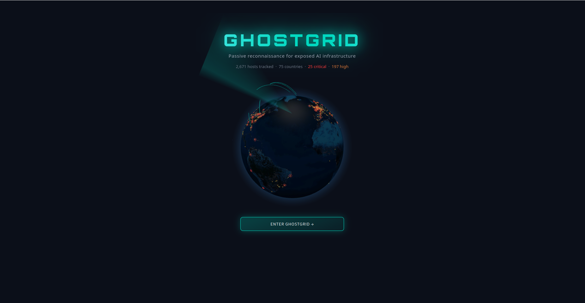
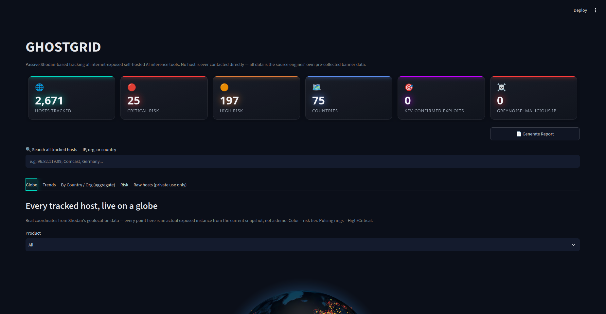
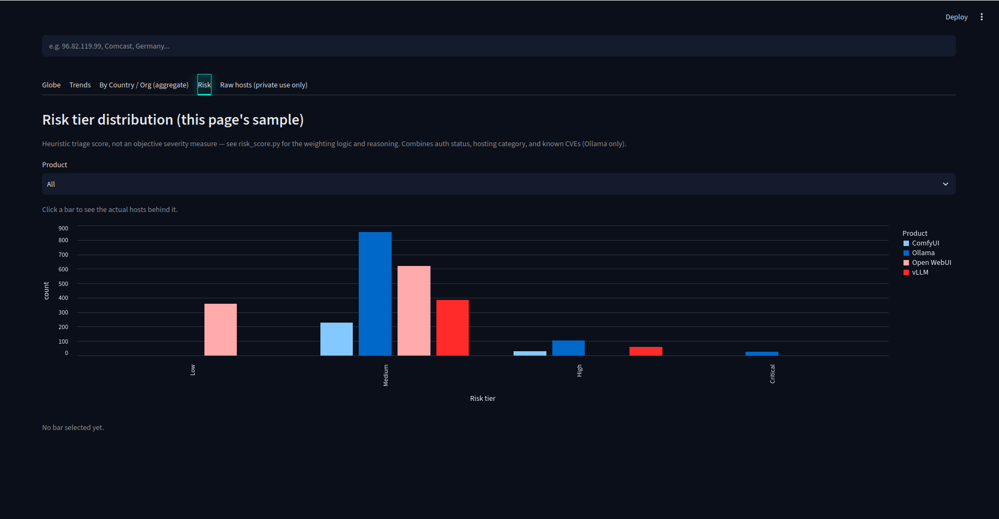
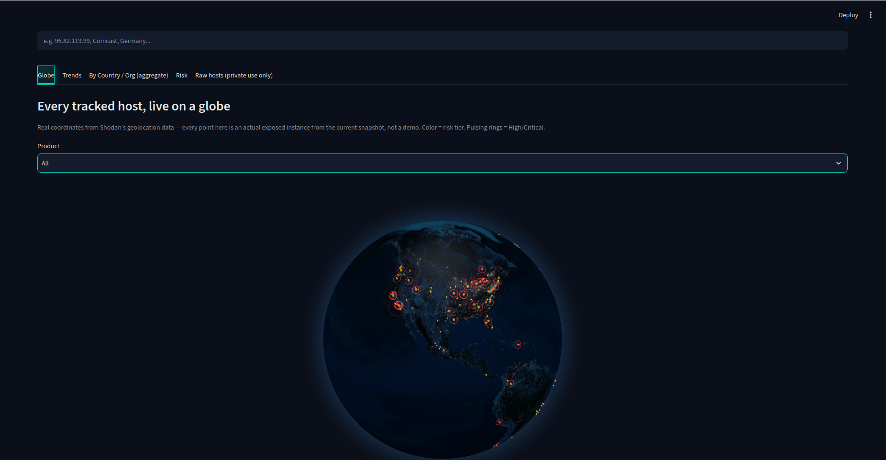

# Exposed AI Radar

Passive Shodan-based tracking of internet-exposed self-hosted AI inference
tools (Ollama, Open WebUI, ComfyUI, vLLM). Never connects to a discovered
host directly — only reads Shodan's own pre-collected banner data.

> **⚠️ Responsible disclosure — read before using this data.**
> This tool is for passive research and reporting exposed hosts to their
> owners/abuse contacts, not for public shaming or exploitation. Aggregate
> data (trend charts, country/org breakdowns) is fine to share publicly.
> **The raw host list (specific IPs) is not** — treat it as private,
> disclosure-only data. Never connect to a discovered host to "verify" it's
> really vulnerable; that's outside what a public dataset like Shodan's
> authorizes. Full policy in [Ethics / scope](#ethics--scope-read-before-extending)
> below.

## Screenshots

| | |
|---|---|
|  |  |
|  |  |

## Setup

```bash
uv sync
```

Put your Shodan API key in `.env` (already gitignored):

```
SHODAN_API_KEY=your_key_here
```

Optional keys for the enrichment scripts below (each degrades gracefully
if unset — only that script exits, the rest of the pipeline is unaffected):

```
CENSYS_API_TOKEN=...      # enrich_censys.py — full open-service inventory
LEAKIX_API_KEY=...        # leakix_collector.py — second discovery source (ComfyUI only)
GREYNOISE_API_KEY=...     # enrich_greynoise.py — internet-scan/malicious-IP cross-reference
```

`radar.db` is gitignored and not included in the repo, so a fresh clone starts
with no data — the dashboard and reports will be empty until you run
`collector.py` at least once (see Usage below). The screenshots above are
from a populated snapshot, not what you'll see on first run.

## Usage

```bash
# Preview query counts without touching the DB
uv run collector.py --dry-run

# Collect a real snapshot (costs 1 query credit per product, ~4/run)
uv run collector.py

# Spend spare Shodan query credits on deeper coverage for specific products,
# without disturbing the existing snapshot (upsert-only, no
# replace_product_snapshot). Check remaining credits first — this hard-exits
# if you request more than you have. Costs (baseline pages + extra_pages)
# credits per targeted product, not just extra_pages: Shodan's pagination is
# a server-side cursor that must be walked sequentially from page 1, so
# jumping straight to page 2+ fails with "Search cursor timed out."
uv run collector.py --supplement --only "Ollama,Open WebUI" --extra-pages 8

# Enrich High/Critical risk-tier hosts with an abuse-contact email (RDAP,
# free, no API key). Separate from collector.py — slower (one HTTP request
# per host) and only relevant to the tier where disclosure actually matters.
uv run enrich_abuse.py

# Cross-reference Critical-tier hosts against GreyNoise's internet-scan
# telemetry (free Community API — see GREYNOISE_API_KEY below). Flags
# whether a host's own IP has independently been seen mass-scanning the
# internet or is classified "malicious" — a stronger signal than exposure
# alone. Budget-limited to 50 lookups/week, shared with the GreyNoise
# Visualizer web UI if you browse there too — keep --limit conservative.
uv run enrich_greynoise.py

# Generate an Executive Snapshot PDF (aggregate-only, no host IPs) — also
# available as a button in the dashboard itself.
uv run python -c "
import sqlite3, pandas as pd
from report_generator import build_report_pdf
conn = sqlite3.connect('radar.db')
hosts = pd.read_sql_query('SELECT * FROM hosts', conn)
runs = pd.read_sql_query('SELECT * FROM snapshot_runs', conn)
open('report.pdf', 'wb').write(build_report_pdf(hosts, runs))
"

# View the dashboard (binds to localhost only — do not change --server.address
# to 0.0.0.0 without thinking hard about it; the irony of this specific tool
# being internet-exposed would not be great)
uv run streamlit run dashboard.py --server.address 127.0.0.1
```

## Ethics / scope, read before extending

- **Passive only.** We only read what Shodan already collected. Never add
  code that connects directly to a discovered host (no "let's just check if
  it's really unauthenticated" follow-up requests) — that crosses from using
  a public dataset into accessing a system you have no authorization for.
- **Aggregate data is fine to publish** (trend charts, country/org
  breakdowns). **The raw host list (specific IPs) is not** — that's for your
  own responsible-disclosure use (reporting to abuse contacts/CERTs), never
  a public blog post or dork list.
- **Query credits are limited** (dev plan: 100/month). Each `collector.py`
  run costs 1 credit per product in `products.py`. Budget before adding more
  products or increasing frequency past weekly.

## Adding a new product

Every entry in `products.py` was manually verified against sample results
before being trusted — don't skip this step. Two candidates (LM Studio,
text-generation-webui) were tried and dropped because their obvious
Shodan queries returned mostly false positives (third-party wrapper apps
mentioning the product name, unrelated directory sites) rather than actual
instances. Check `PRODUCTS[i]["notes"]` for the reasoning behind each
current query before changing it.

**Free pre-check with `api.count()`:** confirmed empirically that Shodan's
count endpoint (`api.count(query)` in the Python library) costs **0 query
credits**, unlike `api.search()` which costs 1 credit per page once any
filter is used — even page 1. Worked fine with the account sitting at 0
remaining credits. Use it to sanity-check a candidate query's magnitude
(implausibly huge = generic/noisy, like the rejected `http.title:"Ray
Dashboard"` query below at 189,555 results) before spending a real credit
to pull samples. Magnitude alone doesn't prove accuracy though — you still
need real samples to confirm the matches are genuinely the target product,
which costs 1 credit per page.

**`candidate_products.py`** holds products that were count-checked and look
plausible but haven't been sample-verified yet (Milvus, Weaviate, Qdrant,
MLflow, Kubeflow, BentoML, ChromaDB — added 2026-09-09), plus a record of
what was rejected at the count stage and why. `verify_candidate.py "<name>"`
pulls one real page (1 credit) so the samples can be eyeballed before
promoting an entry into `products.py`'s live `PRODUCTS` list. Milvus is the
strongest candidate — it hit Shodan's own dedicated product fingerprint
(`product:"Milvus"`, same trust tier as the existing Ollama entry) rather
than a generic title/html match.

## Data model

SQLite (`radar.db`, gitignored):
- `hosts` — one row per (ip, port, product). Includes `hosting_category`
  (rough classification: Cloud/Hosting, Residential ISP, Institution,
  Other/Unknown — see `classify.py`); `cve_flags`/`cve_kev`/`cve_epss_max`
  (best-effort, version-based, Ollama only — see `cve_check.py` and
  `threat_intel.py` for CISA KEV + FIRST.org EPSS enrichment); `risk_score`/
  `risk_tier` (composite heuristic — see `risk_score.py`); and
  `abuse_contact`/`abuse_checked_at` (RDAP-based, High/Critical tier only,
  populated by `enrich_abuse.py`, not `collector.py` — see `abuse_lookup.py`);
  and `greynoise_noise`/`greynoise_riot`/`greynoise_classification`/
  `greynoise_name`/`greynoise_checked_at` (Critical tier by default, free
  Community API, 50 lookups/week — populated by `enrich_greynoise.py`, not
  `collector.py` — see `greynoise_lookup.py`).
- `snapshot_runs` — one row per collector run. `total_reported` (Shodan's
  actual index count for the query) is the trustworthy trend signal.

## Known limitation: RDAP role naming varies by registry

`abuse_lookup.py` prefers an entity with RDAP role `"abuse"`, but verified
empirically that APNIC records for Chinese ISPs (CHINANET etc.) don't use
that role at all — their real contact is labeled `"technical"` or
`"administrative"` instead. There's a documented fallback chain
(`ROLE_PREFERENCE`) for this, and results are tagged with which role they
came from (`[abuse]` vs `[technical]`) so contact quality stays visible.
Also: `rdap.org` (the public bootstrap proxy used) fails transiently under
quick repeated requests — confirmed this silently produced false "no
contact" results before `LookupFailed` was added to distinguish "genuinely
no contact" from "the request itself failed." Failed lookups are never
cached as negative results; they're retried on the next run.

## Fixed bug: hosts table was silently accumulating across runs

`collector.py` used to only ever upsert — it never removed a host that
simply wasn't in a given run's arbitrary page-1 sample. Combined with
Shodan's unstable pagination (see below), repeated runs without a full DB
rebuild caused `hosts` to grow into an ever-larger union of everything
ever observed, not a current snapshot — verified this had silently doubled
Ollama/Open WebUI/ComfyUI row counts (200 instead of 100 each) after a
few runs, inflating every dashboard/report number. Fixed: `collector.py`
now calls `replace_product_snapshot()` to delete a product's existing rows
before inserting the fresh batch, so `hosts` always means "this run's
results," not "everything ever seen." Abuse-contact data (the slow, rate
-limited RDAP lookups) is preserved across the replace for any host that
happens to reappear, via `get_abuse_cache()`/`restore_abuse_contact()` —
only genuinely-stale hosts lose their cached contact, not ones still present.

## Known limitation: no per-host new/gone tracking

This was built and then deliberately removed. Verified empirically that
Shodan's `page=1` search results have **zero IP overlap** between two calls
made 35 seconds apart — for both a huge-total query (Ollama, ~19.5k total)
and a small one (vLLM, ~447 total). Search result ordering isn't stable
across calls on this API tier, so there's no way to tell "this host
disappeared" from "this host just wasn't in today's arbitrary 100-result
sample." Don't rebuild this without first confirming a stable sort/cursor
exists — facets/count-with-facets were also tested and are not available
on the dev plan tier. Trust `total_reported` for trend direction instead.

## Multi-page sampling for small-total products

`products.py` entries can set `"pages": N` to fetch more than one Shodan
results page in a single run. Only worth it as a *standing default* for
products with a small enough total that multiple pages meaningfully approach
full population coverage — vLLM (~448 total) uses 5 pages to capture ~99% of
it for an extra ~4 query credits/run. Not applied as a standing default to
Ollama/Open WebUI/ComfyUI (tens/hundreds of thousands of total results)
because true full-population coverage there is a query-credit economics
problem, not a code problem: at 1 credit per 100 results, ComfyUI's ~191k
total alone would cost ~1,916 credits for one complete pull — versus the dev
tier's 100/month. A paid plan removes the ceiling (Freelancer, $69/mo, gives
10,000 credits/month — enough for a full pull of all four products with
room to spare); on the free tier, see `--supplement` below instead.

### Spending idle credits: `collector.py --supplement`

The free-tier monthly budget often isn't fully used by the standing weekly
job (baseline cost is only ~8 credits/run). `collector.py --supplement
--only "<products>" --extra-pages N` spends leftover credits pushing
specific products deeper, merging into the existing snapshot via upsert
(never wipes it, unlike the normal run). **Important:** Shodan's pagination
is a server-side cursor that must be walked sequentially from page 1 —
requesting page 2+ cold fails with "Search cursor timed out. Restart the
search query from page 1" (confirmed empirically). So depth N still costs N
credits total, not just the pages beyond the existing baseline; there's no
way to cheaply "top up" without re-paying for page 1.

Don't bump the standing `"pages"` default in `products.py` for the
big-total products to chase this instead — `check_credits()` hard-exits the
*entire* run (including vLLM, which currently gets a reliable ~99% pull) if
the account is short, so a permanently higher default risks silently
breaking the automated weekly job for every product until the monthly
reset. `--supplement` is a manual, opt-in spend instead.

## Premium UI pieces

- `premium_ui.py` — animated glassmorphic KPI header + tab styling CSS.
- `globe_view.py` — WebGL 3D globe (globe.gl via CDN) plotting every host
  at its real Shodan-reported coordinates, colored by risk tier, with
  pulsing rings on High/Critical and rotation that pauses on hover.
- `report_generator.py` — the PDF report (reportlab + matplotlib charts).
  Aggregate-only, same no-raw-IPs rule as everywhere else.
- `.streamlit/config.toml` — dark theme matching the globe's aesthetic.

## Automated weekly runs

Installed via cron (Monday 06:00): `0 6 * * 1 /home/jason/exposed-ai-radar/run_weekly.sh`.
Check/edit with `crontab -l` / `crontab -e`.

`run_weekly.sh` runs, in order: `collector.py` (fresh Shodan snapshot) →
`enrich_abuse.py` (RDAP, free) → `enrich_censys.py --tiers Critical High
--limit 20` (budget-capped — Censys's weekly credit reset is small) → a
dated PDF report saved to `reports/snapshot_YYYY-MM-DD.pdf`. Logs go to
`logs/run_<timestamp>.log`; both `logs/` and `reports/` auto-prune to the
20 most recent files so this doesn't grow forever.

Uses absolute paths for `uv` and the project directory throughout, since
cron runs with a minimal environment (no shell PATH, no working directory
assumption) — verified by testing the script with `env -i` before
installing the cron job, not just trusting it'd work unattended.

If a run fails silently, check the most recent file in `logs/` first —
cron won't surface Python tracebacks anywhere else.

## GreyNoise (threat-intel cross-reference, not a discovery source)

Unlike Shodan/LeakIX/Censys, GreyNoise doesn't find new hosts — it answers
a different question about hosts we already found: has this IP
independently been observed mass-scanning the internet, and is it
classified malicious/benign? A Critical-tier exposed-AI host whose IP is
*also* GreyNoise-"malicious" is a meaningfully stronger signal than
exposure alone (compromised/repurposed box, not just misconfigured).

Confirmed empirically (2026-09-09): the Community API is the **only**
free GreyNoise product — everything else (Investigate, Enterprise) is
paid. Getting actual API-key-level access (vs. the keyless 10
lookups/day) requires signing up with a **business/work email** —
accounts on free providers like Gmail don't get key-level access at all.
The endpoint returns HTTP 404 (not 200) for a genuine "not observed
scanning" negative, same real-negative-vs-failure distinction
`censys_lookup.py`/`abuse_lookup.py` already make — don't treat 404 as an
error. No quota-remaining header is exposed, and the 50/week budget is
shared with the GreyNoise Visualizer web UI, so `enrich_greynoise.py`
defaults to a conservative `--limit 15` and Critical-tier only, and
treats an HTTP 429 as a signal to stop the whole run immediately (every
subsequent call would also fail until the weekly reset), not just skip
one host.

## LeakIX (second discovery source, ComfyUI only)

Unlike Censys and ZoomEye, LeakIX's free tier (3000 requests/month, 25
pages/query, 20 results/page) actually supports real search via API —
confirmed working. `leakix_collector.py` uses it, but **scoped to ComfyUI
only**, via LeakIX's dedicated `ComfyUIPlugin` fingerprint module
(`+plugin:ComfyUIPlugin`), not generic text search. Ollama/Open WebUI/vLLM
only match LeakIX's generic `HttpPlugin` there — no better than what
Shodan already gives us, so not worth the redundant integration.

**ZoomEye re-confirmed dead-end (2026-09-09):** a `ZOOMEYE_API_KEY` was
already sitting in `.env` unused. Verified it's a valid key (`userinfo`
shows a real Free-plan account), but `search` returns HTTP 402
`credits_insufficient` — the account's `zoomeye_points` (the balance
search actually spends) is 0, even though `userinfo` also shows a
`points: 3000` field that apparently isn't the same currency. Whether
that's a one-time signup bonus already spent, a separate resource, or a
Free-plan quirk wasn't resolved via the API alone — would need checking
the account dashboard at zoomeye.ai directly, or a paid top-up, before
`ZOOMEYE_API_KEY` is usable for anything. Endpoints for reference if
revisited: `POST https://api.zoomeye.ai/v2/search` /
`https://api.zoomeye.ai/v2/userinfo`, `API-KEY` header, JSON body with a
base64-encoded `qbase64` dork (modern syntax uses `=`, e.g.
`app="Ollama"`, not Shodan's `:`). Don't add `zoomeyeai` as a project
dependency if this does get unblocked — its pinned `requests==2.26.0`
conflicts with Streamlit's `requests>=2.27`; call the REST API directly
with plain `requests` instead, same pattern as `censys_lookup.py`.

Stored with `source='leakix'` alongside Shodan's `source='shodan'` rows for
the same product — the `(ip, port, product, source)` primary key lets both
coexist without clobbering each other. `hosts` table totals now reflect
both sources combined; the same physical host found by both engines will
appear as two rows, not deduplicated (a possible future improvement).

**Caught and fixed a real bug before trusting this data**: initially
assumed LeakIX's `service.credentials.noauth` field was a genuine per-host
confirmed-auth check (a real accuracy win over Shodan's default-assumption
approach). Pulled 160 real hosts and found `noauth: False` with **zero
variation** — that uniformity across diverse hosts/orgs proved the field
isn't actually tested by this plugin, just a generic schema default. Fixed
to fall back to the same documented-default assumption used for Shodan's
ComfyUI entry, instead of shipping deflated risk scores for every
LeakIX-sourced host.

## Suggested next steps

- If you ever regenerate the Shodan key, just update `.env` — nothing else
  references it directly.
- Consider deduplicating hosts found by both Shodan and LeakIX (same IP)
  when computing dashboard/report totals, rather than counting twice.
- Shodan query credits are 0 as of 2026-09-09 (spent via `--supplement` on
  Ollama/Open WebUI, taking each from 100 to ~980-990 fetched hosts) and
  reset monthly at the start of the calendar month — next reset 2026-10-01.
  Until then the standing weekly `collector.py` call in `run_weekly.sh` will
  fail with "Not enough query credits" (harmless — the rest of the weekly
  pipeline doesn't depend on Shodan and keeps running; see run_weekly.sh's
  `set -uo pipefail`, not `-e`). After the reset, consider a recurring
  `--supplement` spend as part of the monthly routine rather than letting
  credits sit unused, if a Freelancer-plan upgrade isn't in the cards.
